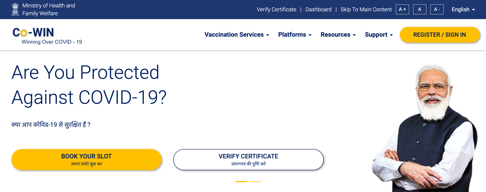

# COWIN COVID-19 Sputnik Vaccine Slot Informer

This script helped me book a slot for taking the SPUTNIK-V Vaccine. It checks for the availability of slots every second and spams your telegram with notifications once a slot is available. I ran it on my Linux server for about a week, and I could finally book a slot.

Sputnik-V Vaccine slots were pretty hard to book during the months after Summer. They would be gone within minutes after the bookings have opened on [COWIN](https://www.cowin.gov.in/). I only wanted to take the Sputnik vaccine.

I manually scraped the COWIN site and monitored the networks tab on chrome. And found an API to request the data. The script is not that organized, so I suggest you first understand the JSON data you get as a response for calling the API. It is preferred to know about creating a telegram bot to understand this script's `telegram(message)` function.
